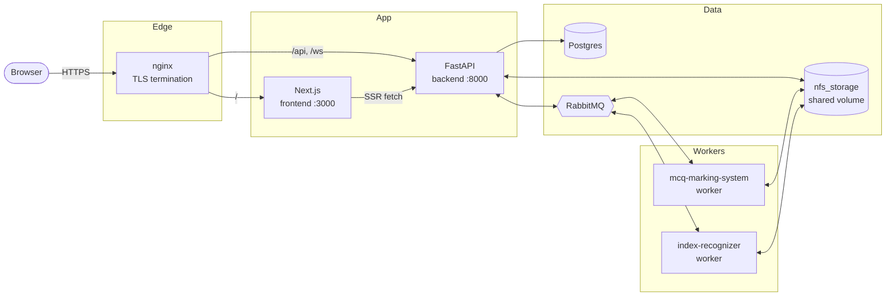

# 📝 Edumark — Automatic MCQ Grader

> Scan answer sheets, recognise filled bubbles, mark them against a scheme, and serve results through a web dashboard. A multi-service stack you can run with one `docker compose up`.

Edumark is built for universities and instructors who grade large MCQ batches and don't want to feed every sheet through a manual workflow. A user uploads scanned answer sheets, an OMR template, and a marking scheme through the web UI; background workers detect filled bubbles and recognise printed index numbers; the backend applies the scheme and surfaces per-student results in the dashboard. Everything is containerised and ships as a single Docker Compose stack.

---

## Table of contents

- [Architecture](#architecture)
- [Repository layout](#repository-layout)
- [Prerequisites](#prerequisites)
- [Local development](#local-development)
- [Production deployment](#production-deployment)
- [What's different between dev and prod](#whats-different-between-dev-and-prod)
- [Common operations](#common-operations)
- [Troubleshooting](#troubleshooting)
- [Where to go next](#where-to-go-next)
- [Maintainers](#maintainers)

---

## 🏗️ Architecture



| Service in the diagram | Source folder | Role |
|---|---|---|
| `nginx` | [nginx/](nginx/) | Terminates TLS, routes `/api` + `/ws` to the backend, everything else to the frontend. Disabled in dev. |
| `frontend` | [next_frontend/](next_frontend/) | Next.js 15 app-router UI. Server-side middleware also talks to the backend over the docker network. |
| `backend` | [fastapi_backend/](fastapi_backend/) | FastAPI: REST + WebSocket. Handles auth, file uploads, scheme persistence, and queues jobs to the workers. |
| `postgres` | (image only) | Stores users, faculties, templates, schemes, jobs, results. Init scripts in [fastapi_backend/init-db/](fastapi_backend/init-db/). |
| `rabbitmq` | (image only) | Job and result queues between backend and workers. Management UI on `:15672`. |
| `mcq-marking-system` | [mcq_marking/](mcq_marking/) | Consumes template-config, marking-scheme, and marking jobs. Produces results. |
| `index-recognizer` | [index_recognision/](index_recognision/) | OCR for printed student index numbers on each sheet. |
| `nfs_storage` | (docker volume) | Shared filesystem (uploads, intermediate artifacts, results) — mounted at `/shared` in backend + workers. Pre-populated by the `shared-storage` init container. |

---

## 📁 Repository layout

```
.
├── docker-compose.yml            # Production base (env_file-driven, no insecure defaults)
├── docker-compose.override.yml   # Dev overlay; auto-merged by `docker compose up`
├── .env.example                  # Compose-time vars — copy to .env
├── .env.app.example              # App runtime vars — copy to .env.app
├── build-and-push.sh             # Builds and pushes all 4 images to your registry
├── nginx/
│   └── nginx.conf.template       # envsubst inserts ${DOMAIN_NAME} at container start
├── docs/
│   └── ENV.md                    # Every environment variable, explained
├── fastapi_backend/              # FastAPI API + SQLAlchemy models + auth + websockets
│   ├── app/                      #   Application code
│   ├── init-db/                  #   Postgres init scripts (uuid-ossp etc.)
│   ├── Dockerfile, Dockerfile.dev
│   └── pyproject.toml
├── next_frontend/                # Next.js 15 (app router) frontend
│   ├── app/                      #   Routes
│   ├── components/, hooks/, utils/
│   ├── .env.local.example        #   Copy to .env.local for `next dev`
│   └── Dockerfile, Dockerfile.dev
├── mcq_marking/                  # RabbitMQ worker: template config + sheet marking
│   ├── app/
│   └── Dockerfile, Dockerfile.dev
├── index_recognision/            # RabbitMQ worker: index-number OCR
│   └── Dockerfile, Dockerfile.dev
├── mcq_marking_old/              # Legacy reference implementation — NOT wired into compose
├── samples/                      # Example sheets/templates/schemes for manual testing
└── README.md                     # ← you are here
```

`mcq_marking_old/` is kept for historical and migration reference only. No service or build script touches it; safe to ignore for day-to-day work.

---

## ✅ Prerequisites

- **Docker Engine + Compose v2** (`docker compose version` should report `≥ 2.x`).
- **~4 GB free RAM** for the dev stack (Postgres + RabbitMQ + frontend dev server are the hungry ones).
- **For production**: a VM with public IP, a domain pointed at it, ports `80`/`443` open, and a Docker Hub (or compatible) account for image push/pull.
- **For secret generation**: no host Python required — the snippets below run via one-shot Docker containers.

---

## 💻 Local development

The dev override file is auto-merged by `docker compose` (no `-f` flag). It builds images locally from `Dockerfile.dev`, exposes host ports for everything, bind-mounts source for hot reload, and skips nginx.

### 1. Get the source

```bash
git clone <repo-url> mcq-ocr
cd mcq-ocr
```

### 2. Create env files from the templates

```bash
cp .env.example                     .env
cp .env.app.example                 .env.app
cp next_frontend/.env.local.example next_frontend/.env.local
```

### 3. Generate a super-user password hash

```bash
docker run --rm python:3.12-slim sh -c \
  "pip install -q bcrypt && python -c 'import bcrypt;print(bcrypt.hashpw(b\"admin123\", bcrypt.gensalt(12)).decode())'"
```

Paste the output into `.env.app` as `SUPER_USER_PASSWORD`, with every `$` doubled to `$$` (Compose's escape — runtime sees a single `$`).

Generate a JWT signing key while you're at it:
```bash
docker run --rm python:3.12-slim python -c "import secrets; print(secrets.token_urlsafe(48))"
```
Paste into `.env.app` as `SECRET_KEY`.

For everything else, the example defaults work for dev. The full reference (which vars are required, what valid values look like, how to generate the rest) lives at **[docs/ENV.md](docs/ENV.md)**.

### 4. Bring the stack up

```bash
docker compose up -d --build
docker compose ps                       # all services should be "healthy"
docker compose logs -f backend frontend # watch boot
```

First boot pulls `postgres:15-alpine`, `rabbitmq:3.12-management`, and `alpine:latest`, then builds your four service images. Allow a minute or two.

### 5. Use it

| Endpoint | URL | Notes |
|---|---|---|
| Frontend | http://localhost:3000 | Sign in with `SUPER_USER_EMAIL` / your chosen plaintext password. |
| API | http://localhost:8000 | Swagger UI at `/docs`. |
| RabbitMQ management | http://localhost:15672 | User/pass from `.env` (`RABBITMQ_USER` / `RABBITMQ_PASSWORD`). |
| Postgres | `localhost:5432` | User/pass from `.env` (`POSTGRES_USER` / `POSTGRES_PASSWORD`). |

> **macOS users**: if `docker compose up` fails with `docker-credential-desktop: not found`, add Docker Desktop's bin directory to your PATH:
> ```bash
> echo 'export PATH="/Applications/Docker.app/Contents/Resources/bin:$PATH"' >> ~/.zshrc
> source ~/.zshrc
> ```

---

## 🚀 Production deployment

Single compose file, registry-hosted images, nginx in front terminating TLS.

### 1. Provision the VM

A small Linux VM (2 vCPU / 4 GB RAM is plenty to start), Docker + Compose v2 installed, your domain's `A`/`AAAA` records pointing at its public IP, and firewall open on `80` and `443`.

### 2. Get the deployment files onto the VM

You don't need the whole source tree — just:
- `docker-compose.yml`
- `nginx/`
- `fastapi_backend/init-db/`
- `.env` + `.env.app` (filled in)
- `ssl/cert.pem` + `ssl/key.pem` (created in step 5)

The application code itself lives inside the pre-built images.

### 3. Generate secrets

Same one-liners as dev — `SECRET_KEY` and the bcrypt `SUPER_USER_PASSWORD`. Plus a strong DB and broker password:
```bash
openssl rand -base64 32 | tr -d '/+=' | head -c 32
```

### 4. Fill `.env` and `.env.app`

Every required variable is listed in **[docs/ENV.md](docs/ENV.md)**. Especially:

- `DOMAIN_NAME` matches the domain your A record points to.
- `DOCKER_REGISTRY` is the registry namespace you'll push images to.
- `ALLOWED_HOSTS` in `.env.app` includes `https://${DOMAIN_NAME}`.
- `COOKIE_SECURE=true`, `COOKIE_SAMESITE=none` (the production defaults in the example).
- `POSTGRES_PASSWORD` / `RABBITMQ_PASSWORD` are the **same** values referenced from inside `.env.app`'s `DATABASE_URL` / `RABBITMQ_URL`.

### 5. Obtain TLS certificates

```bash
sudo certbot certonly --standalone -d "$DOMAIN_NAME"
sudo mkdir -p ./ssl
sudo cp /etc/letsencrypt/live/$DOMAIN_NAME/fullchain.pem ./ssl/cert.pem
sudo cp /etc/letsencrypt/live/$DOMAIN_NAME/privkey.pem   ./ssl/key.pem
sudo chown -R $(id -u):$(id -g) ./ssl
```

Set up a renewal cron (`certbot renew --quiet` is enough; `nginx` reads the mounted files on container restart).

### 6. Build and push images (from your dev machine)

```bash
export $(grep -v '^#' .env | xargs)
./build-and-push.sh "$DOCKER_REGISTRY" "$IMAGE_TAG"
```

The script validates that you've logged into Docker (`docker login`), confirms `BACKEND_URL` is set, then builds and pushes `backend`, `frontend`, `marking`, and `recognizer` images. The frontend bakes `NEXT_PUBLIC_BACKEND_URL` into the bundle at build time, so `BACKEND_URL` must match your production API URL.

### 7. Deploy on the VM

```bash
docker compose -f docker-compose.yml pull
docker compose -f docker-compose.yml up -d
docker compose ps
```

The `-f docker-compose.yml` flag is important — it skips the dev override so you get registry-pulled images, nginx, and no host port exposure for Postgres/RabbitMQ.

### 8. Verify

```bash
curl -fsS https://$DOMAIN_NAME/api/health     # → {"status":"healthy",…}
curl -fsS -I https://$DOMAIN_NAME             # → 200 OK from the Next.js frontend
```

Open `https://$DOMAIN_NAME` in a browser and sign in as your super-user.

---

## ⚖️ What's different between dev and prod

| Aspect | Dev | Prod |
|---|---|---|
| Compose invocation | `docker compose up` (override auto-applied) | `docker compose -f docker-compose.yml up` |
| Images | built locally from `Dockerfile.dev` | pulled from `$DOCKER_REGISTRY` |
| Source code mount | bind-mounted for hot reload | none — baked into the image |
| Host ports exposed | `3000`, `8000`, `5432`, `5672`, `15672` | only `80` and `443` via nginx |
| TLS | none — plain HTTP on `localhost` | nginx terminates via `ssl/cert.pem` |
| Cookies | `COOKIE_SECURE=false`, `COOKIE_SAMESITE=lax` | `COOKIE_SECURE=true`, `COOKIE_SAMESITE=none` |
| nginx | skipped (profile `donotstart`) | running |

---

## 🛠️ Common operations

```bash
# Restart one service
docker compose restart backend

# Rebuild + restart one service (dev)
docker compose up -d --build backend

# Tail logs from selected services
docker compose logs -f backend mcq-marking-system

# Open a shell in a running container
docker compose exec backend bash

# Stop the stack (preserves volumes)
docker compose down

# Wipe everything including volumes — destroys Postgres data
docker compose down -v

# Run backend tests inside the container
docker compose exec backend pytest -q

# See the merged compose configuration (handy for debugging dev override)
docker compose config

# Pull updated images on the VM and redeploy
docker compose -f docker-compose.yml pull && docker compose -f docker-compose.yml up -d
```

---

## 🩺 Troubleshooting

1. **macOS: `docker-credential-desktop: not found`** during `compose pull`.
   Docker Desktop is installed but not on PATH. Run:
   ```bash
   echo 'export PATH="/Applications/Docker.app/Contents/Resources/bin:$PATH"' >> ~/.zshrc
   source ~/.zshrc
   ```

2. **Backend exits at boot with "Configuration failed to load. Missing required environment variables:"** followed by a list of names.
   Your `.env.app` is incomplete. Cross-check the listed names against [docs/ENV.md](docs/ENV.md) — every field marked **Required** must be present.

3. **Next.js logs `TypeError: fetch failed … ECONNREFUSED ::1:8000`** when middleware runs.
   The frontend container is trying to call `localhost:8000`, which inside the container is itself. `INTERNAL_BACKEND_URL=http://backend:8000` must be set on the frontend service (it is, in both compose files — only fails if you removed it).

4. **Compose warns `The "Y0tzgYyka9nQ..." variable is not set. Defaulting to a blank string.`**
   You forgot to escape `$` in a bcrypt hash inside `.env.app`. Double every `$` → `$$`:
   ```diff
   - SUPER_USER_PASSWORD=$2b$12$Y0tzgY...
   + SUPER_USER_PASSWORD=$$2b$$12$$Y0tzgY...
   ```

5. **`docker compose -f docker-compose.yml config` errors with "required variable XYZ is missing a value"**.
   `.env` is missing a value — the production compose file uses `${VAR:?error}` so missing values fail loudly instead of silently defaulting.

---

## 🧭 Where to go next

- **Environment variables**: [docs/ENV.md](docs/ENV.md) — every variable, where it's read, how to generate it.
- **API**: Swagger UI at `${BACKEND_URL}/docs` once the stack is running.
- **Sample data**: [samples/](samples/) contains example answer sheets, templates, and marking schemes you can use to walk through the marking flow end-to-end.

---

## 👤 Maintainers

Repository owner: Vihanga Munasinghe — [vihangamunasinghe.22@cse.mrt.ac.lk](mailto:vihangamunasinghe.22@cse.mrt.ac.lk).
